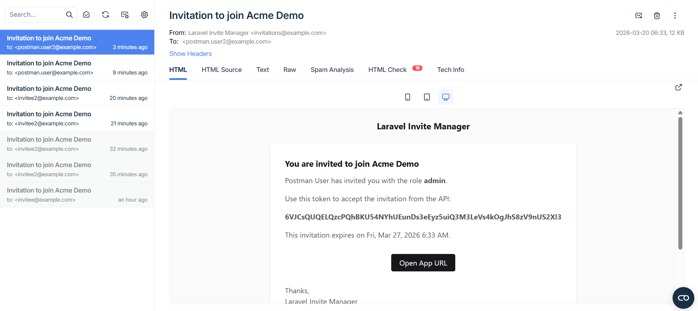

# Laravel Invite Manager API

## Requisitos

- Docker

## Puesta en marcha

1. Instalar dependencias PHP con Composer (primero):

```bash
docker run --rm -u "$(id -u):$(id -g)" -v "$(pwd):/var/www/html" -w /var/www/html laravelsail/php84-composer:latest composer install --ignore-platform-reqs
```

2. Levantar contenedores:

```bash
./vendor/bin/sail up -d
```

3. Preparar entorno:

```bash
cp .env.example .env
# Actualizar credenciales de email en .env (Mailtrap)
./vendor/bin/sail artisan key:generate
```

4. Migrar y seedear:

```bash
./vendor/bin/sail artisan migrate:fresh --seed
```

5. Ejecutar tests:

```bash
./vendor/bin/sail artisan test
```

Notas:

- Mailtrap se usa con credenciales en `.env`.

Usuarios demo del seeder:

- `admin@example.com` / `password123`
- `manager@example.com` / `password123`
- `member@example.com` / `password123`

## Endpoints

Base URL: `http://127.0.0.1/api/v1`

Auth:

- `POST /auth/register`
- `POST /auth/login`
- `GET /auth/me`
- `POST /auth/logout`

Organizations:

- `GET /organizations`
- `POST /organizations`
- `GET /organizations/{organization}`
- `PUT /organizations/{organization}`
- `DELETE /organizations/{organization}`
- `GET /organizations/{organization}/members`
- `DELETE /organizations/{organization}/members/{email}` (admin)
- `PATCH /organizations/{organization}/members/role` (admin, identificador por email)
- `PATCH /organizations/{organization}/members/deactivate` (admin o manager)

Invitations:

- `GET /organizations/{organization}/invitations` (admin o manager)
- `POST /organizations/{organization}/invitations` (admin o manager)
- `GET /invitations/{token}`
- `POST /invitations/accept`

Reglas clave implementadas:

- `manager` solo puede invitar con rol `member`.
- `admin` puede invitar con cualquier rol.
- No se permite invitar a un usuario ya miembro activo con el mismo rol en la misma organización.
- Cambio de rol usa el email del usuario destino como identificador.

## Flujo de la aplicación web

1. Un usuario autenticado (admin o manager) crea invitación para una organización.
2. El sistema valida permisos y reglas de rol.
3. Se envía correo por Mailtrap con token de invitación.
4. El invitado consulta la invitación por token.
5. El invitado acepta:

- Si no existe usuario, se registra en ese paso.
- Si existe, se asigna membresía.

6. Se devuelve token Sanctum para sesión API.
7. Admin puede cambiar rol por email o remover por email.
8. Admin o manager pueden desactivar (soft-delete) la membresía por email.

## Capturas

Captura del correo recibido en Mailtrap:



## Colección Postman para pruebas manuales:

- `docs/postman/Laravel-Invite-Manager.postman_collection.json`
